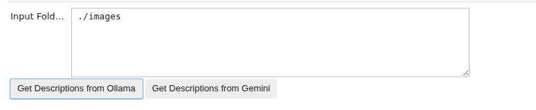
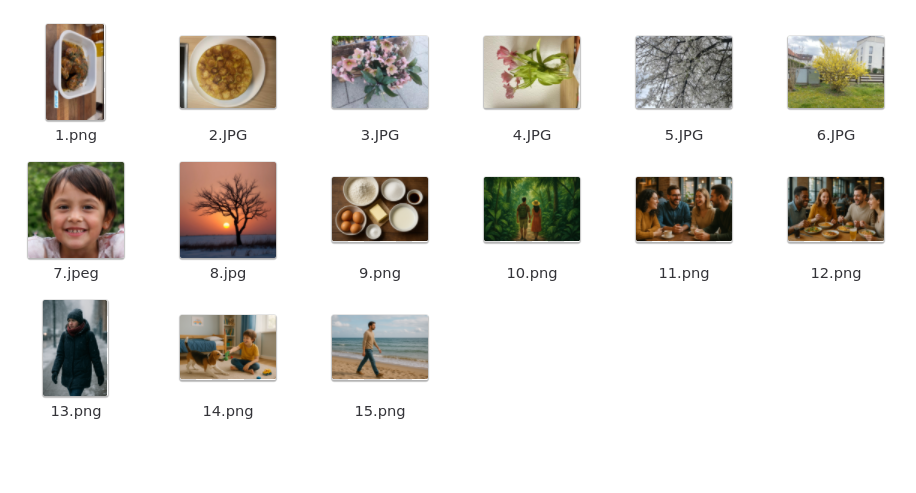
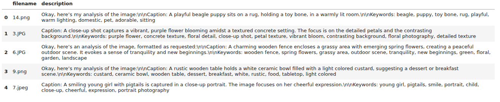
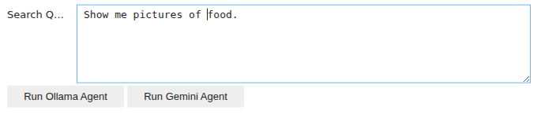
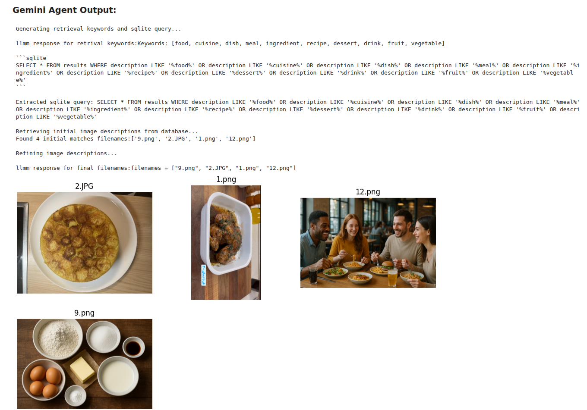

# Gallery Image Retrieval Agent (GIRA)
This system provides LLM-based image retrieval agent for your gallery, allowing you to find images using natural language queries. It operates in two main steps:  
- Image Understanding (offline):  
The system utilizes the Gemma Multimodal Model (Gemma 3:4b) to analyze and generate descriptive captions for each image in your gallery. These semantic captions are then stored in a searchable database for quick and accurate image retrieval.

- User Query Processing and Image Retrieval Agent (online):  
When a user submits a natural language query (e.g., "pictures of a dog playing in a park"), the system provide Gemma or Gemini Agent which leveraging the Gemini API or the Gemma API respectively. This API is used to generate keywords, enabling a semantic search of the user's query within the previously generated image captions database. After extracting captions that include related keywords, they are analyzed by gemini or gemma model and the most relevant pictures are selected for display.
## Requirements
- Python3
- docker
- Gemni API key: This is the specific credential you'll use to authenticate your requests to the Gemini API. In the abscenec of Gemini API key, you can use gemma agent which uses local gemma model for User query processing and image R\retrieval.
  
## Installation
1. Copy you Gemini API key from Google AI studio in API.env file in the project repository.(optional)
2. Run docker compose to build Jupyter and ollama containers.
   
  ```bash
  docker compose up --build -d
  ```
## Usage
1. Open jupyterlab on port 8888 of your computer
2. go to foler home/notebooks/
3. run `get_description.ipynb` and enter the address of your image folder then click on Get Descriptions from Ollama or Gemini depending on which model you want to use.  


- Here is a sample of an image folder and some of the desrcriptions:
    


4. run `gallery_agent.ipynb` add enter your query and select your desiered agent to show the results.




